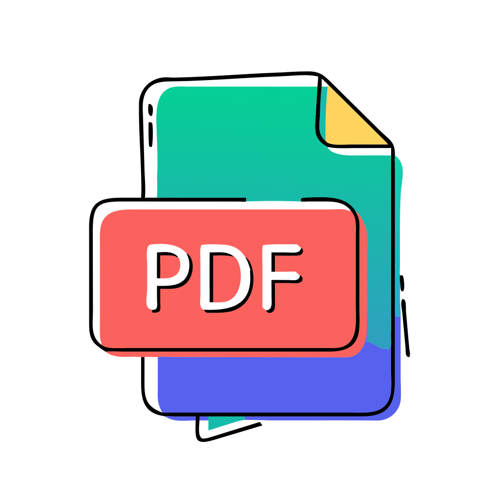
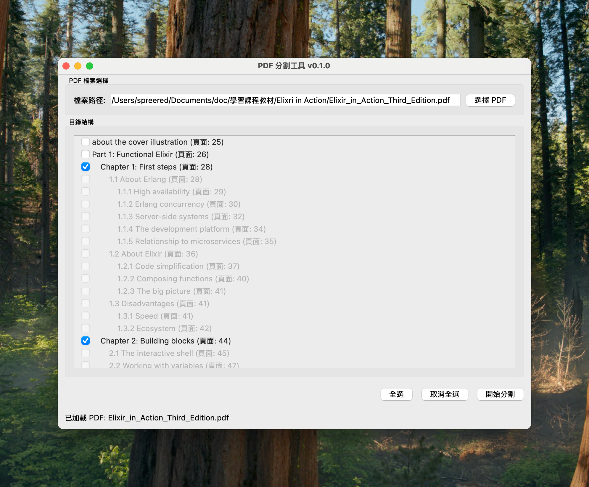

# PDF Chunking Tool



可以將 PDF 電子書依照自己所選的章節切成多個 PDF 檔案，方便後續使用（例如餵給 ChatGPT 或 Notebooklm）

A desktop application that allows users to select a PDF file, view its table of contents, and chunk the PDF into multiple smaller PDF files based on selected chapters. The application runs locally and prioritizes ease of use for PDF processing.

## Features

- **File Selection**: Provides a button to open a file dialog for PDF selection
- **ToC Extraction**: Automatically extracts the Table of Contents (ToC) from the PDF
- **Hierarchical Display**: Shows the PDF ToC in a tree-like structure for easy selection
- **Smart Selection**:
  - When a parent chapter is selected, all its child chapters are automatically included in the same chunk
  - When a parent chapter is not selected, child chapters can be individually selected
- **Automatic Chunking**: Automatically determines page ranges and creates new PDF files based on selected chapters
- **Friendly Naming**: Chunked files are named using the original filename plus the chapter title
- **CLI / Headless Mode**: Scriptable command-line interface with JSON output, designed for AI agents and automation pipelines

## Screenshot



## Technology Stack

- **Programming Language**: Python
- **PDF Processing**: PyMuPDF (fitz)
- **GUI Framework**: PySide6 (Qt for Python)

## Installation

### Requirements

- Python 3.8 or higher
- Supported Operating Systems: Windows, macOS, Linux

### Setup

1. Clone or download this project to your local machine

2. Install dependencies. Choose either method:

**With uv (recommended):**

```bash
uv sync              # Installs CLI/runtime + dev dependencies
uv sync --extra gui  # Also install PySide6 for the GUI
```

**With pip:**

```bash
pip install -r requirements.txt
```

## Usage

### Method 1: Running from Source Code

1. Launch the application:

```bash
python pdf_chunker_gui.py
```

2. Click the "Select PDF" button to choose a PDF file to process

3. Check the chapters you want to split in the ToC list:
   - Checking a parent chapter will automatically include all its child chapters
   - When a parent chapter is not checked, child chapters can be individually checked

4. Click the "Start Chunking" button

5. Select an output directory

6. Wait for the process to complete; the system will display a list of created PDF chunk files

### Method 2: Command-Line Interface (Headless / AI agents)

For automation, scripting, or letting an AI agent drive the chunking, use `pdf_chunker_cli.py`. All commands support `--json` for structured output.

Thanks to [PEP 723](https://peps.python.org/pep-0723/) inline metadata, you can run it with **zero setup** via uv:

```bash
uv run pdf_chunker_cli.py inspect book.pdf
```

(uv will auto-create an isolated environment with the required dependencies on first run.)

If you have already run `uv sync`, you can also use the project environment directly:

```bash
uv run python pdf_chunker_cli.py inspect book.pdf
```

#### `inspect` — show PDF structure

Lists the Table of Contents with the page range each entry would span if selected individually (`span_pages`) and how many descendants it has (`children`). This is what an AI agent reads first to decide how to chunk.

```bash
uv run pdf_chunker_cli.py inspect book.pdf            # human-readable
uv run pdf_chunker_cli.py inspect book.pdf --json     # JSON for scripts/agents
```

#### `plan` — preview chunks without writing files

Pure dry-run. Returns the chunks that *would* be produced, including page ranges, page counts, and output paths.

```bash
uv run pdf_chunker_cli.py plan book.pdf --level 1 -o ./out --json
uv run pdf_chunker_cli.py plan book.pdf --select 0,3-5 -o ./out --json
uv run pdf_chunker_cli.py plan book.pdf --match "第.*章" -o ./out --json
```

Selection modes (mutually exclusive, one required):
- `--select <indices>`: comma-separated indices/ranges, e.g. `0,2,5-7`. Indices come from `inspect`.
- `--level <N>`: select every ToC entry at level N (e.g. `--level 1` for top-level chapters).
- `--match <regex>`: select every ToC entry whose title matches the regex.

#### `chunk` — write the PDF files

Same arguments as `plan`, but actually writes the output PDFs.

```bash
uv run pdf_chunker_cli.py chunk book.pdf --level 1 -o ./out --json
```

### Method 3: Using Pre-compiled Version (macOS)

1. Go to the GitHub Releases page and download the latest `.dmg` file

2. Open the `.dmg` file and drag the PDFChunker application to your Applications folder

3. Launch PDFChunker from the Applications folder or Launchpad

4. Follow steps 2-6 as described above

## Creating a Standalone Application (macOS)

You can create a standalone macOS application (`.app` bundle) using PyInstaller. This allows users to run the application without needing to install Python or any dependencies.

1.  **Install PyInstaller**:
    If you haven't already, install PyInstaller:
    ```bash
    pip install pyinstaller
    ```

2.  **Navigate to the project directory**:
    Open your terminal and change to the project's root directory:
    ```bash
    cd path/to/your/chunk_pdf
    ```

3.  **Run PyInstaller**:
    Use the following command to build the application. This command creates a single executable file within an `.app` bundle, suitable for GUI applications.
    ```bash
    pyinstaller --name "PDFChunker" --onefile --windowed --icon="path/to/your/icon.icns" pdf_chunker_gui.py
    ```
    *   `--name "PDFChunker"`: Sets the name of your application.
    *   `--onefile`: Bundles everything into a single executable inside the `.app`.
    *   `--windowed`: Prevents a terminal console window from appearing when the GUI app runs.
    *   `--icon="path/to/your/icon.icns"`: (Optional) Specifies the path to your custom application icon (`.icns` file). If you don't have one, you can omit this or create one.
    *   `pdf_chunker_gui.py`: The main script for your application.

4.  **Find the application**:
    After PyInstaller finishes, you will find the `PDFChunker.app` (or the name you specified) inside the `dist` directory within your project folder.

5.  **Distribute**:
    You can then distribute this `.app` file. For wider distribution, consider code signing and notarization for macOS. The generated `.app` file should **not** be committed to the Git repository; instead, use GitHub Releases to distribute it.

**Note on `.gitignore`**:
Ensure that PyInstaller's build artifacts are ignored by Git. The `.gitignore` file in this project should already include:
```gitignore
build/
dist/
*.spec
```

## File Description

- `pdf_chunker.py`: Core logic class for handling PDF loading, ToC extraction, and chunking functionality
- `pdf_chunker_gui.py`: GUI implementation using PySide6 to create the user interface
- `pdf_chunker_cli.py`: Command-line interface (`inspect` / `plan` / `chunk`) with JSON output, suitable for AI agents and automation. Includes PEP 723 inline metadata for `uv run` zero-setup execution.
- `test_chunker.py`: Smoke-test script for testing core logic functionality
- `test_cli.py`: pytest suite covering the CLI (JSON schema, selection modes, error paths)
- `create_test_pdf.py`: Script for creating test PDF files
- `pyproject.toml`: uv project configuration (runtime, optional `gui` extra, and `dev` group)
- `requirements.txt`: Legacy dependency list for `pip install`

## Testing

Run the pytest suite (uses `uv` to manage the dev environment):

```bash
uv sync                # Installs pytest into .venv
uv run pytest          # Runs test_cli.py
```

The suite covers the CLI's JSON schema contract, all three selection modes, real PDF output verification, and error exit codes.

## Error Handling

The application handles the following situations:

- **No ToC**: If the PDF has no table of contents, a warning message is displayed
- **Encrypted/Unreadable PDF**: If the PDF cannot be opened, an error message is displayed
- **File I/O Errors**: Handles potential errors when saving chunked files
- **Filename Sanitization**: Automatically cleans invalid characters in chapter titles to ensure valid filenames

## License

This project is licensed under the MIT License.

## Contributing

Feel free to submit issue reports, feature requests, or contribute code directly.
